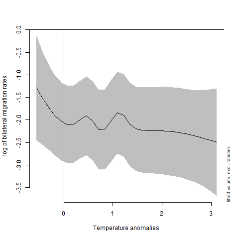
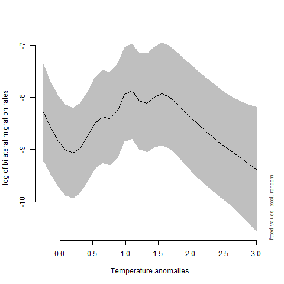
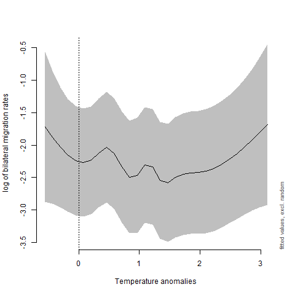
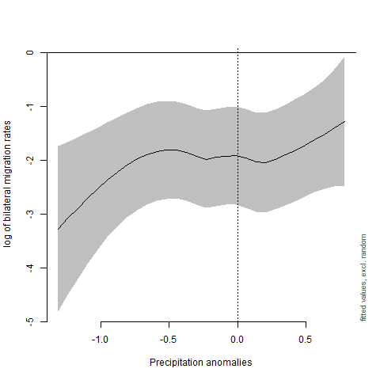
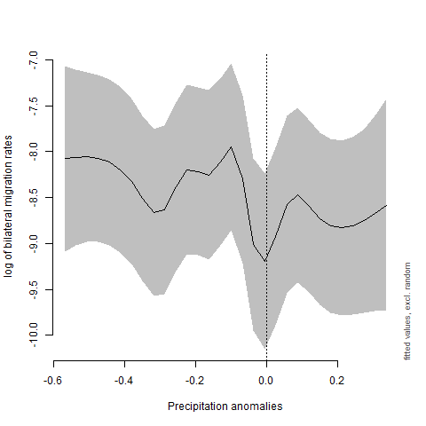
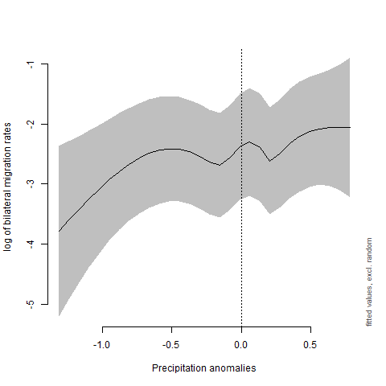

# Replication package for "A Real-Options Analysis of Climate Change and International Migration"

This repo contains R code as well as the [dataset](prepared/Dataset_final.csv) used for the empirical analysis of the research paper "A Real-Options Analysis of Climate Change and International Migration", published in *Environment and Development Economics* (Braun 2023).
In the paper, semiparametric regression models are used to investigate nonlinear effects of climate change on international migration. For low-income countries, I find a robust hump-shaped relationship between temperature anomalies and migration rates; this effect appears to be primarily driven by migration to other low- and middle-income countries. For middle-income countries, on the other hand, no robust effects of temperature and precipitation anomalies on migration rates can be observed.

Follow these steps to replicate the results of the paper:

## 1. Setting up the R environment

First, open the R project file [Real_Options_Climate_Migration.Rproj](Real_Options_Climate_Migration.Rproj) in RStudio. It is important to work in the R project, as it is associated with the directory that the project is located in and will set the working directory accordingly.
After opening the R project file, open [setup.R](setup.R). Running the file will set up an R environment using the `renv` package, which manages project-local R dependencies to ensure that existing data analysis workflows work as they did before;
for more information see https://rstudio.github.io/renv/articles/renv.html

Proceed as follows:

1. Call `options(repos = c(REPO_NAME = "https://packagemanager.rstudio.com/all/2022-08-01+Y3JhbiwyOjQ1MjYyMTU7RTY0MEEyRTM"))`
to load the CRAN snapshot from RStudio Package Manager. This will freeze to the R packages as they were available at the time that the analysis was conducted.

2. Install `renv` by calling `install.packages("renv")`.

3. Call `renv::init()` to initialize a new project-local environment with a private R library.
`bare = TRUE`: instead of installing dependencies automatically, we install packages manually.

4. Install the required packages.

5. Call `renv::snapshot()` to save the state of the project library.

The state of the library is saved in the [renv.lock](renv.lock) file.

## 2. Descriptive statistics

[descriptive_statistics.R](scripts/descriptive_statistics.R) produces descriptive statistics and density plots of the main variables for low- and middle-income countries.
In addition, t-tests comparing low- and middle-income sample means for the main variables are provided.

## 3. Main Results

[results.R](scripts/results.R) produces the main results of the paper. Generalized additive models (GAMs) with Gamma distribution and log-link function are employed to estimate nonlinear relationships between climatic anomalies and international migration for the total sample as well as for low- and middle-income countries. In a GAM, the explanatory variables are specified in terms of smooth nonparametric functions, thus requiring no restrictive a priori assumptions about any parametric functional form (for more details see Wood 2017). Instead, the degree of nonlinearity is determined directly from the data using an automated smoothing selection criterion. For comparison, generalized linear models with climate variables entering the estimation linearly are also estimated. In addition, GAMs are estimated with interaction terms for migration to contiguous destination countries as well as to OECD destination countries.

The general workflow is the same for all of the regression models:

`estimate_gam(sample, formulae, model_type)` estimates a generalized additive model (GAM) with Gamma distribution and log link function using the `mgcv` package (Wood 2001). In addition, a number of diagnostic checks of the model fitting are produced. The estimation of the GAMs is quite computationally expensive, and depending on the model, this may take up to a few hours to execute (hence the `tic()` and `toc()` commands surrounding the model call). The arguments of the function are as follows:
  - `sample`: the sample for which the model is to be estimated. `"total"` for the total sample, and `"lowinc"` and `"midinc"` for low- and middle-income samples, respectively.
  - `formulae`: the regression formula for the model to be estimated. The baseline formula used in the GAMs for the main results is ```mig_rate_new ~ s(temp_anom, bs='cr') + s(precip_anom, bs='cr') + period + X...origin + destination```, with `s(temp_anom, bs='cr')` and `s(precip_anom, bs='cr')` as smooth nonparametric terms for temperature and precipitation anomalies, respectively.
  - `model_type`: `"gam"` for GAM and `"glm"` for GLM, passed to generate model file names.

`show_gam(sample, climate_var, model)` produces plots of the estimated smooth nonparametric functions using the `itsadug` package. The arguments of the function are as follows:
- `sample`: the sample for which smooths are to be plotted. `"total"` for the total sample, and `"lowinc"` and `"midinc"` for low- and middle-income samples, respectively.
- `climate_var`: the climatic variable to be plotted. `"temp_anom"` for temperature anomalies and "`precip_anom` for precipitation anomalies.
- `model`: the `gam` object from which smooths are to be plotted.
- `by`: optional argument for interactions with factor variables. `"contiguity"` for contiguity dummy and `"OECD_dest"` for OECD destination dummy.

The resulting plots should resemble the following figures:

|Total sample|Low-income|Middle-income|
|----|----|----|
||||
||||

Proceed analogously for all other models.

## 4. Robustness Checks

[robustness_checks.R](scripts/robustness_checks.R) produces a host of robustness checks of the main results, including

- alternative definitions of low- and middle-income countries,
- alternative smoothing parameter selection method,
- interacting measures of climatic anomalies with a factor variable indicating origin countries’ quartile in the distribution of agricultural value added as a share of GDP,
- including a number of control variables identified as important determinants of international migration in the literature,
- use five-year period shares of heat and drought months as alternative measures of climatic anomalies,
- excluding observations with temperature anomalies more than two standard deviations above or precipitation anomalies more than two standard deviations below the respective sample mean.

The general workflow for the models is identical to the one outlined for the main results.

## References

Braun, M. (2023), A real-options analysis of climate change and international migration, *Environment and Development Economics*, 1-20. https://doi.org/10.1017/S1355770X23000013

Wood, S.N. (2001), mgcv: GAMs and generalized ridge regression for R, *R News* 1, 20-25.

Wood, S.N. (2017), *Generalized Additive Models: An Introduction with R*. CRC press, Boca Raton, FL.
